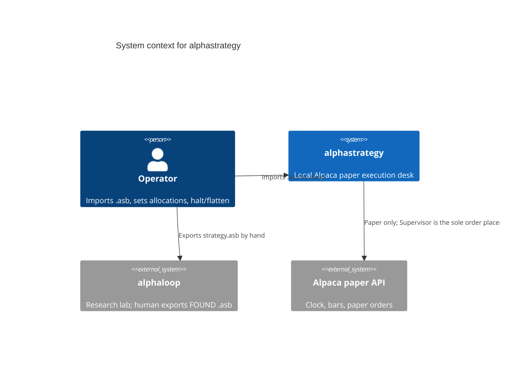
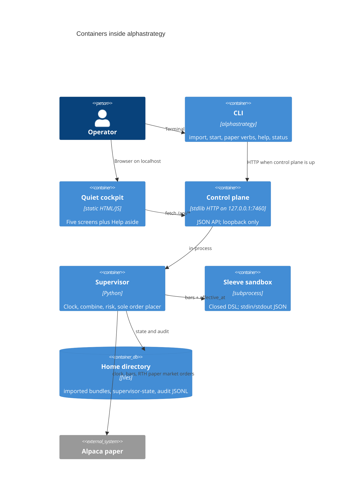

# About the alphastrategy runtime

This is explanation, not a how-to. The operator runbook lives in `alphastrategy help` and the Quiet cockpit Help aside. The product contract is [`docs/requirements/2026-08-19-alphastrategy-v1-requirements.md`](../requirements/2026-08-19-alphastrategy-v1-requirements.md).

alphastrategy is a **local paper execution desk**. It does not search for strategies. alphaloop does that work and, when a candidate is `FOUND`, a human exports a `.asb` bundle. alphastrategy never calls alphaloop and never sends fills, PnL, or drift back.

## Why one Supervisor

Several running bundles must not each place orders against the same Alpaca paper account, or they fight over positions. v1 therefore gives **one** process the keys and the right to order: the Supervisor. Sleeve interpreters evaluate a closed DSL in a sandbox. They return target weights. They never see secrets, network, or a broker handle.

Combined target:

```text
combined[asset] = Σ_i allocation_i * weight_i[asset]
```

`Σ allocation_i <= 1`. Residual is cash. A miss versus that target is an `execution_deviation` in the audit log; the DSL is not rewritten.

Heartbeat every 20 seconds is health and reconciliation only. It does **not** rebalance and does **not** place orders. At most two regular rebalances fire per RTH session (open +3 minutes, close −12 minutes).

Halt is not flatten. Dirty data, disconnect, or a dead sandbox **halts** (no new orders, hold the book). Manual account kill, SIGINT/SIGTERM, and limit breaches **flatten** when the broker is reachable. Resume does not catch up.

## System context (C4 level 1)

People and other systems. alphaloop is an export-only neighbor, not a runtime dependency.



There is no arrow from alphastrategy back to alphaloop.

## Containers (C4 level 2)

One OS process in v1. “Containers” here are runnable units inside that process plus the home directory and the remote paper API.



Same picture in the v1 ASCII:

```text
Web / CLI
    |
    v
Local control plane (localhost)
    |
    v
Supervisor  <-- sole holder of Alpaca keys and sole order placer
    |
    +-- sleeve interpreters (one sandbox process per running bundle)
```

## What this diagram deliberately omits

- A C4 **code** diagram (classes). The modules under `src/alphastrategy/` are small enough to read.
- Live money, public bind, WebSockets, a strategy editor, VWAP/TWAP.
- `src/openstrategy/`: historical research library, not packaged, not this product.

Component-level names that match the tree: `bundle/` (import and hash), `dsl/` (sandbox), `supervisor/` (session loop), `live/` (Alpaca paper adapter), `api/` (control plane), `web/static/` (Quiet cockpit), `cli/` (entry).
